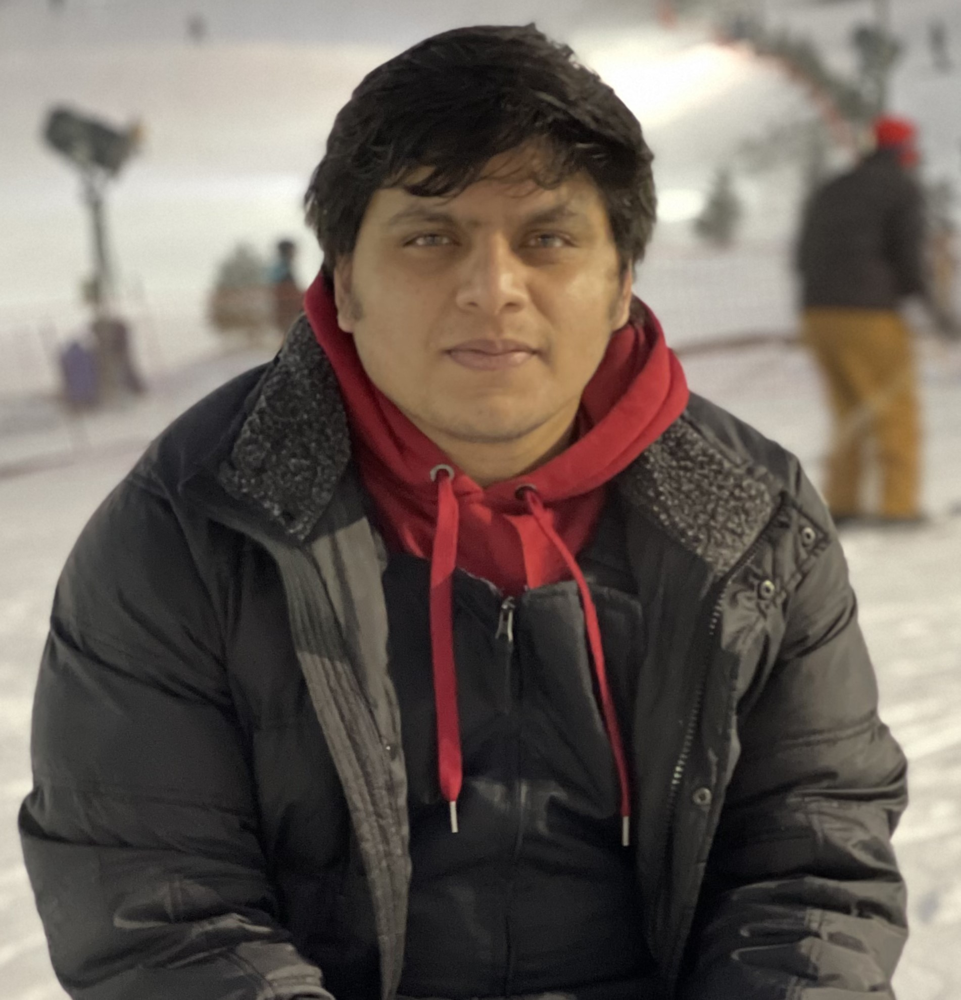

## About Me

> **I will graduate soon and currently surfing the job market for full-time research positions.**

Hello! I'm Sahil (pronounced as 'saa-hill'), a grad student in the Department of Intelligent Systems Engineering (majoring in Computer Engineering) at the Luddy School of Informatics, Computing and Engineering of Indiana University Bloomington (IUB).

A systems researcher working at the intersection of Cloud Computing, Big Data, Distributed systems and AI/ML. Currently, my research focuses on building efficient computation and communication models to scale AI/ML from edge to cloud and HPC (working on topics like distributed ML training, federated learning, gradient compression, stream processing, differential privacy, etc.).

Outside of research, I'm also an amateur photographer mainly shooting wildlife and space. [Here](https://www.flickr.com/photos/200009325@N03/) are some of my pictures.

---

## Research Interest

- Large-scale ML systems
- Deep Learning
- Federated Learning
- Distributed Systems
- Edge, Cloud and High-performance computing
- Big Data analytics

---

## Publications

- **Conference Proceedings**
	1. **Tyagi, S.**, & Swany, M. (2023). Flexible Communication for Optimal Distributed Learning over Unpredictable Networks. 2023 IEEE International Conference on Big Data (BigData), 925-935 *(Accep. rate 17.5%)* [[pdf]](files/adopt.pdf).
	1. **Tyagi, S.**, & Swany, M. (2023). Accelerating Distributed ML Training via Selective Synchronization. 2023 IEEE International Conference on Cluster Computing (CLUSTER), 1-12 *(Accep. rate 25%)* [[pdf]](files/selsync.pdf).
	1. **Tyagi, S.**, & Swany, M. (2023). GraVAC: Adaptive Compression for Communication-Efficient Distributed DL Training. 2023 IEEE 16th International Conference on Cloud Computing (CLOUD), 319-329 *(Accep. rate 20%)*[[pdf]](files/gravac.pdf).
	1. **Tyagi, S.**, & Sharma, P. (2023). Scavenger: A Cloud Service For Optimizing Cost and Performance of ML Training. 2023 IEEE/ACM 23rd International Symposium on Cluster, Cloud and Internet Computing (CCGrid), 403-413 *(Accep. rate 21%)*[[pdf]](files/scavenger.pdf).
	1. **Tyagi, S.**, & Swany, M. (2022). ScaDLES: Scalable Deep Learning over Streaming data at the Edge. 2022 IEEE International Conference on Big Data (Big Data), 2113-2122 *(Accep. rate 19.2%)*[[pdf]](files/scadles.pdf).
	1. **Tyagi, S.**, & Sharma, P. (2020). Taming Resource Heterogeneity In Distributed ML Training With Dynamic Batching. 2020 IEEE International Conference on Autonomic Computing and Self-Organizing Systems (ACSOS), 188-194 *(Accep. rate 25%)*[[pdf]](files/resource_taming.pdf).
	1. Widanage, C., Li, J., **Tyagi, S.**, Teja, R., Peng, B., Kamburugamuve, S., Baum, D., Smith, D., Qiu, J., & Koskey, J. (2019). Anomaly Detection over Streaming Data: Indy500 Case Study. 2019 IEEE 12th International Conference on Cloud Computing (CLOUD), 9-16 *(Accep. rate 20%)*[[pdf]](files/indy500.pdf).
	1. Chaturvedi, S., **Tyagi, S.**, & Simmhan, Y.L. (2017). Collaborative Reuse of Streaming Dataflows in IoT Applications. 2017 IEEE 13th International Conference on e-Science (e-Science), 403-412 *(Accep. rate 36%)*[[pdf]](files/collaborative_escience.pdf).  

- **Poster Presentations**
	1. **Tyagi, S.** (2023). Scavenger: A Cloud Service for Optimizing Cost and Performance of DL Training. 2023 IEEE/ACM 23rd International Symposium on Cluster, Cloud and Internet Computing Workshops (CCGridW), 349-350[[pdf]](files/scavenger_poster.pdf).
	1. **Tyagi, S.**, & Swany, M. (2023). Accelerating Distributed ML Training via Selective Synchronization (Poster Abstract). 2023 IEEE International Conference on Cluster Computing Workshops (CLUSTER Workshops), 56-57[[pdf]](files/selsync_poster.pdf).  

- **Journal articles**
	1. **Tyagi, S.**, & Sharma, P., “OmniLearn: A Framework for Distributed Deep Learning over Heterogeneous Systems,” (in preparation), 2024.
	1. Chaturvedi, S., **Tyagi, S.**, & Simmhan, Y.L. (2019). Cost-Effective Sharing of Streaming Dataflows for IoT Applications. IEEE Transactions on Cloud Computing, 9, 1391-1407.

---

## Teaching Experience

Course | Role | Term
---------------------------|---------------------------------------------------------
High-Performance Computing | Associate Instructor | 		Spring 2024
    Computer Networks 	   | Associate Instructor | 	Fall 2023, Fall 2022
	Operating Systems 	   | Associate Instructor | 		Spring 2023
	Distributed Systems    | Associate Instructor | 	Spring 2022, Spring 2021
	Cloud Computing 	   | Associate Instructor |   Fall 2021, Fall 2020, Fall 2019

---

## Professional Services
- *USENIX OSDI 2024* (Artifact evaluation committee)
- *USNIX ATC 2024* (Artifact evaluation committee)
- *IEEE CLUSTER 2024* (Technical program committee)

---

## Awards and Achievements
- *NSF Student Grant*: To present research at IEEE CLUSTER 2023, Santa Fe, New Mexico.
- *Luddy Dean’s Graduate Student Award*: In Fall 2023 for outstanding research.
- *NSF Travel Award*: To present research at IEEE/ACM CCGrid 2023, Bengaluru, India.
- *Best early-career researcher poster award*: Awarded at IEEE/ACM CCGrid 2023.
- *Google Cloud Student Researcher (2021, 2022)*: Received GCP credits for research.
- *Student Research Award*: Funded via grant NSF Data Infrastructure Building Blocks (DiBBS) 17-500, for academic year 2018-2019.

---

## Presentations and Talks

1. **4/24**: Guest lectures, "Parallel Computing with GPUs for Distributed ML Applications", High-Performance Computing (HPC) course, Indiana University Bloomington, USA.
1. **12/23**: Paper presentation, "Flexible Communication for Optimal Distributed Learning over Unpredictable Networks." 2023 IEEE International Conference on Big Data, Sorrento, Italy.
1. **11/23**: Paper presentation, "Accelerating DistributedMLTraining via Selective Synchronization." 2023 IEEE International Conference on Cluster Computing, Santa Fe, New Mexico, USA.
1. **11/23**: Poster presentation, "Accelerating Distributed ML Training via Selective Synchronization." 2023 IEEE International Conference on Cluster Computing, Santa Fe, New Mexico, USA.
1. **07/23**: Paper presentation, "GraVAC: Adaptive Compression for Communication-Efficient Distributed DL Training." 2023 IEEE International Conference on Cloud Computing, Chicago, Illinois.
1. **05/23**: Paper presentation, "Scavenger: A Cloud Service for Optimizing Cost and Performance of ML Training." 2023 IEEE/ACMInternational Symposium on Cluster, Cloud and Internet Computing, Bengaluru, India.
1. **05/23**: Poster presentation, "Scavenger: A Cloud Service for Optimizing Cost and Performance of ML Training." 2023 IEEE/ACMInternational Symposium on Cluster, Cloud and Internet Computing, Bengaluru, India.
1. **12/22**: Paper presentation, "ScaDLES: Scalable Deep Learning over Streaming Data at the Edge." 2022 IEEE International Conference on Big Data, Osaka, Japan.
1. **07/20**: Paper presentation, "Taming Resource Heterogeneity in Distributed ML Training with Dynamic Batching." 2020 IEEE International Conference on Autonomic Computing and Self-Organizing Systems, virtual.
1. **11/18**: "Real-Time Anomaly Detection from Edge to HPC-Cloud", Intel Speakerships at SC18 (Proceedings of the International Conference for High Performance Computing, Networking, Storage and Analysis 2018), Dallas, Texas, USA.

---

## References

* [Martin Swany](https://luddy.indiana.edu/contact/profile/?profile_id=307), Dept. of Intelligent Systems Engineering, Indiana University Bloomington
* [Yogesh Simmhan](https://cds.iisc.ac.in/faculty/simmhan/), Dept. of Computational and Data Sciences, Indian Institute of Science, Bengaluru, India.